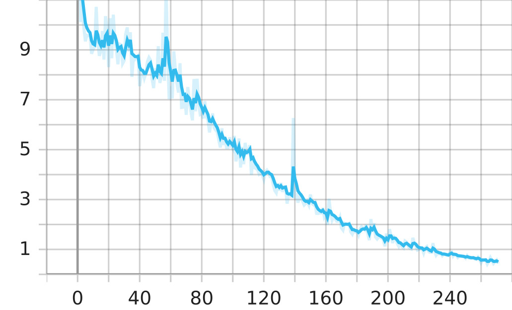
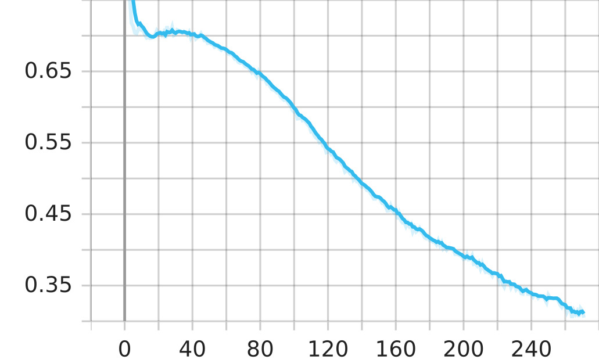
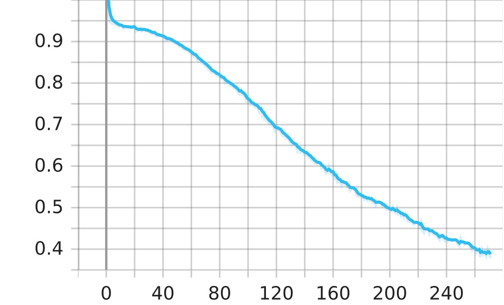

# Diffusion ASR Training (Docker Compose)

This project contains a self-contained Docker environment for training an ASR (Automatic Speech Recognition) diffusion model. All dependencies, code, and logs live **inside the container**, so no host mounting is required.

You can run training interactively and save metrics/loss plots as SVG images.

---

## Prerequisites

- Linux with NVIDIA GPU + Docker + NVIDIA Container Toolkit
- `docker` & `docker-compose` installed
- CUDA 12.4 compatible GPU drivers

---

## Build Docker Image

```bash
docker compose build
```

This will copy the mini dataset and its processed .pt files to the /app folder.

## Run Interactive Container

```bash
docker compose run --rm asr
```

You will get a bash prompt inside the container at /app.
All code, logs, and checkpoints are inside the container.

Once inside the interactive container shell, to run training,

```bash
root@xxxxxx:/app# python3 train.py
```

## Adapting LLaDA loss for ASR

[Large Language Diffusion Models](https://doi.org/10.48550/arXiv.2502.09992)

$$
\begin{array}{l}
\hline
\textbf{Algorithm 2} \text{ Supervised Fine-Tuning of LLaDA} \\
\hline
\textbf{Require: } \text{mask predictor } p_{\theta}, \text{ pair data distribution } p_{\text{data}} \\
\begin{array}{rll}
1: & \mathbf{repeat} \\
2: & \quad p_0, r_0 \sim p_{\text{data}} & \text{// please refer to Appendix B.1 for details} \\
3: & \quad t \sim \text{U}(0, 1) \\
4: & \quad r_t \sim q_{t|0}(r_t \mid r_0) & \text{// } q_{t|0} \text{ is defined in Eq. (7)} \\
5: & \quad \text{Calculate } \mathcal{L} = -\frac{1}{t \cdot L'} \sum_{i=1}^{L'} \mathbf{1}[r_t^i = \text{M}] \log p_{\theta}(r_0^i \mid p_0, r_t) & \text{// } L' \text{ is the sequence length of } r_0 \\
6: & \quad \text{Calculate } \nabla_{\theta}\mathcal{L} \text{ and run optimizer.} \\
7: & \mathbf{until} \text{ Converged} \\
8: & \mathbf{Return} \text{ } p_{\theta} \\
\end{array} \\
\hline
\end{array}
$$

To run inference, change the audio path, steps, and the checkpoint in the inference.py.
Then run

```bash
root@xxxxxx:/app# python3 inference.py
```

## Training loss and metric curves

<div align="center">

<table>
<tr>
  <td align="center">
    <br/>
    <strong>Training Loss</strong>
  </td>
  <td align="center">
    <br/>
    <strong>Character Error Rate (CER)</strong>
  </td>
  <td align="center">
    <br/>
    <strong>Word Error Rate (WER)</strong>
  </td>
</tr>
</table>

</div>

## Sample ASR inference using 3000 denoising steps


## Sample ASR inference using 100 denoising steps


