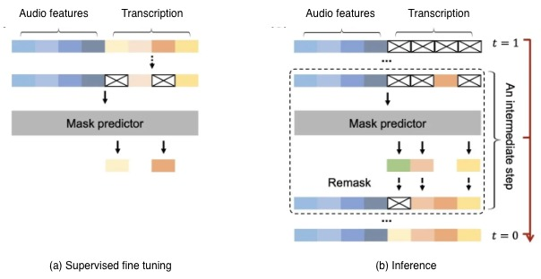
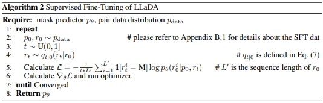

# Automatic speech recognition using Diffusion language models

Traditional ASR models like Zipformer, Conformer, ESPNet, Whisper and wav2vec are sequence to sequence models.
They are autoregressive models that predict the next token in the sequence.
Such models have a bottleneck with inference speeds when transcribing long sentences.

[Large Language Diffusion Models](https://doi.org/10.48550/arXiv.2502.09992) (LLaDA) [18 oct 2025], is a diffusion model that generates language as a probabilistic inference.
It's a masked language model that uses iterative denoising process to generate tokens parallel in contrast to sequence to sequence models. It is pretrained for masked prediction by a transformer model.

Once pretrained, it follows a supervised finetuning (SFT) where the dataset is in the form of prompts and responses.
The responses are masked using a probability distribution and then the loss is computed only on the masked predictions.
During the inference process, we start with a completely masked response and iteratively denoise the predicted tokens over sampling steps.

In this project, we adapt LLaDa's supervised finetuning protocol for ASR, and generate transcriptions using denoising process.
We utilise audio features in place of prompts, and transcripts in place od responses and do masked modelling.
The architecture is as follows:

<div align="center">
    
</div>

Additionally, we adapt the scaled loss in Algorithm 2 to optimise our network and showcase that transcriiption is possible using diffusion protocol.

<div align="center">
    
</div>

### Pipeline and Contributions

1. Audio file is processed by wav2vec from facebook to give us `audio_features` [bs, h, 768]
2. These audio_features are then processes for padding by randomly sampling num `window_size` indices < h and sorting them to get `src` [bs, window_size, 768]. There are other methods to process but we did this to take temporally coherent and dropped features.
3. The transcription is tokenized and padded to transcription_length to get `input_ids`.
4. The input\*ids are masked using a _Bernoulli_ distribution to get `masked_ids`. The scr and `masked_ids` are the inputs to the transformer model.
5. `Loss` is computed between the predicted masked tokens and ground truth.
6. Grandient clipping is done for stability purposes.

### Implementation Highlights

| Component             | Status          | Description                                               |
| :-------------------- | :-------------- | :-------------------------------------------------------- |
| **Transformer Model** | **Self**        | Full implementation of Attention and Positional Encoding. |
| **Masking Strategy**  | **Self**        | Bernoulli-based masking for diffusion denoising.          |
| **Scaled Loss**       | **Algorithm 2** | Adapted from LLaDA for Supervised Fine-Tuning (SFT).      |

# Diffusion ASR Training (Docker Compose)

This project contains a self-contained Docker environment for training an ASR (Automatic Speech Recognition) diffusion model. All dependencies, code, and logs live **inside the container**, so no host mounting is required.

You can run training interactively and save metrics/loss plots as SVG images.

---

## Prerequisites

- Linux with NVIDIA GPU + Docker + NVIDIA Container Toolkit
- `docker` & `docker-compose` installed
- CUDA 12.4 compatible GPU drivers

---

## Build Docker Image

```bash
docker compose build
```

This will copy the mini dataset and its processed .pt files to the /app folder.

## Run Interactive Container

```bash
docker compose run --rm asr
```

You will get a bash prompt inside the container at /app.
All code, logs, and checkpoints are inside the container.

Once inside the interactive container shell, to run training,

```bash
root@xxxxxx:/app# python3 train.py
```

To run inference, change the audio path, steps, and the checkpoint in the inference.py.
Then run

```bash
root@xxxxxx:/app# python3 inference.py
```

## Training loss and metric curves

<div align="center">

<table>
<tr>
  <td align="center">
    <br/>
    <strong>Training Loss</strong>
  </td>
  <td align="center">
    <br/>
    <strong>Character Error Rate (CER)</strong>
  </td>
  <td align="center">
    <br/>
    <strong>Word Error Rate (WER)</strong>
  </td>
</tr>
</table>

</div>

## ASR inference using 3000 denoising steps


## ASR inference using 100 denoising steps


